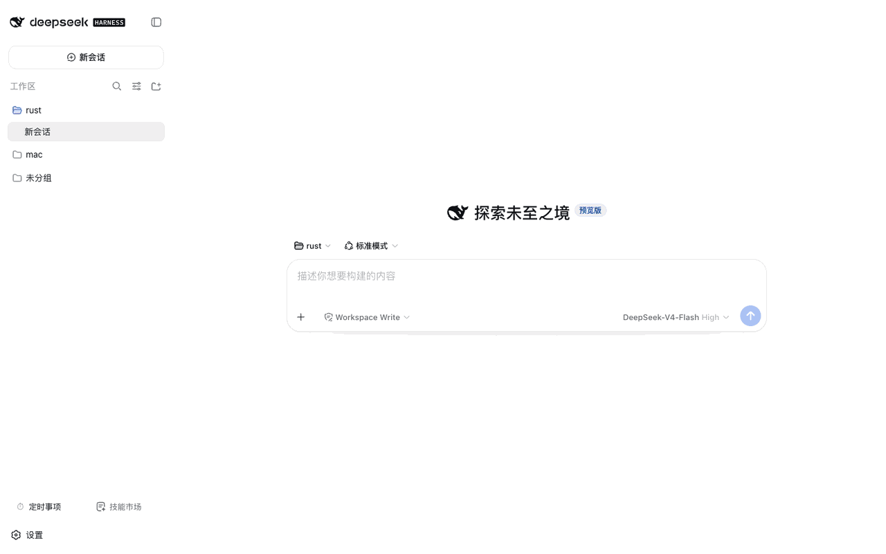

# @weibaohui/skills-management

[](https://github.com/topics/dsh-plugin)
[](https://www.npmjs.com/package/@weibaohui/skills-management)

**技能市场插件**：一个页面管理本机所有 coding agent 的技能，还能浏览安装 6600+ 的 ntd 技能市场。



## 核心功能

- **全来源扫描**：自动扫描本机各 coding agent 的技能目录（Claude、ZCode、Codex、WorkBuddy 等十余个执行器），统一在一个页面查看、查看详情、单文件预览
- **一键收编**：任意执行器的技能可一键复制进 DSH 用户库，供模型的 `skill` 工具直接调用
- **技能市场**：内置 ntd 技能合集（6600+ 条），按来源分组浏览、搜索筛选、详情预览、一键安装
- **注入开销统计**：每张技能卡片和详情显示「≈N token · M 字符」（按名称+描述全文、cl100k_base 词表估算，与 tiktokenizer 同词表同值），支持按 token/字符排序，一眼看出哪些技能最占上下文
- **模型可见性治理**：每个已装技能都有「模型可调用」开关，不想暴露给模型的技能一键隐藏/恢复
- **输入框 ＋ 技能**：composer 工具行新增「＋ 技能」按钮，弹出带搜索框的技能候选浮层（候选 = 宿主技能注册表，与 `/` 菜单同源；支持键盘 ↑/↓/Enter/Esc），选中即把 `/技能名` 写入草稿，发送时技能内容注入该条消息
- **市场自动同步**：市场仓库自动克隆与每日更新（可关），支持 GitCode 私有仓库 access token
- **稀疏检出**：ntd-resource 仓库同时携带专家/模板等子树，市场只检出 `skills` 子目录（git partial clone + sparse-checkout），省一半以上流量与磁盘；已有全量检出会在下次同步时原地转换
- **软链布局兼容**：各执行器目录间软链共享的技能不会重复展示

## 安装

```bash
dsh plugin --profile web add @weibaohui/skills-management -w
```

装完重启 `dsh web` 即生效。

## 使用

1. 打开 Web UI → **设置** → 左侧「技能市场」section 即完整管理页（可搭配 dsh-settings-ui 插件把设置窗口调大/全屏）
2. 「已安装」视图管理本机技能；「市场」视图浏览/搜索/安装 ntd 合集技能；「执行器」视图按来源钻入查看各 coding agent 的技能
3. 详情页可预览 SKILL.md 全文、安装到用户库、切换模型可调用开关
4. ⚙ 设置面板里可配置市场仓库地址、分支、access token 与自动同步

## 联系我 :飞书群


